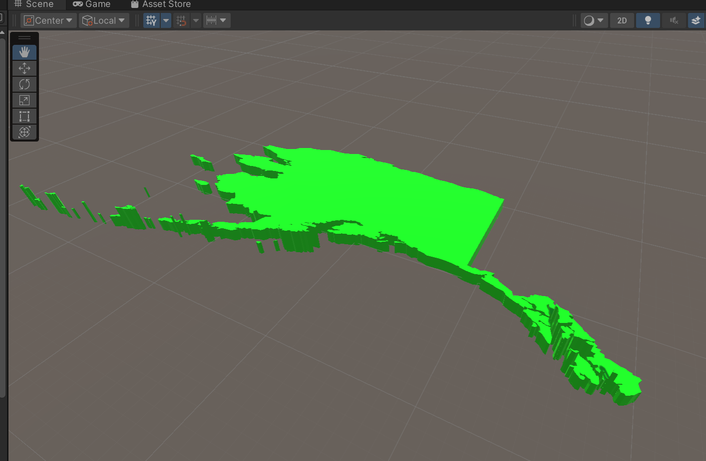

# PrismMapper

Unity Third-Party Library for creating prism map

-------------
#### This library is to create Prism Maps. The expected output shows blow.

Maps with boundary:

Maps without boundary:

The data is from：<https://github.com/johan/world.geo.json/tree/master/countries/USA>
